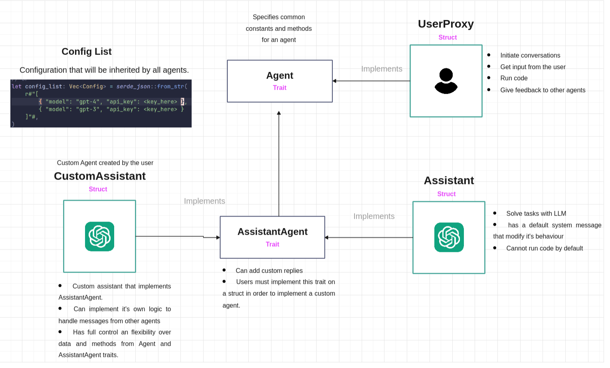

> [!WARNING]
> Work in progress, this is not finished yet. Not ready to be used.



# initialization

The first step is to load the configuration. This can be done be reading a json file, or by manually initialing the struct. This configuration will be passed to all the agents.

```rs
let config_list: Vec<Config> = Config::from_file("config.json").unwrap();
// or
let config_list: Vec<Config> = serde_json::from_str(
    r#"[ { "model": "gpt-4" } ]"#,
)
.unwrap();
```

# Agents
## Initializing
We initialize the agents using the builder pattern. This pattern is great when you have many optional values or you want to hide initialization logic, which is the case here.

```rs
// ...rest of the code
let mut assistant = AssistantBuilder::new("assistant").config_list(config.clone()).build();
let mut user_proxy = UserProxyBuilder::new("user_proxy").config_list(config).build();
```

### Advantages
- Agent initialization details hidden on the `build` function.
- Flexible custom agents, with their own data structures, and custom functions to handle messages.

## Agents Communication

Agents communicate with each other by using Rust built-in mpsc channel. Actually, the code uses the tokio version of mpsc, which is async.

They exchange an enum `AgentMessage`.

```rs
// ...rest of the code
let user_ctx = user.ctx.clone();
let assistant_ctx = assistant.ctx.clone();

let handle = spawn(async move {
    spawn(async move {
        assistant.run().await;
    });

    user.run().await;
});

user_ctx
    .tx
    .send(AgentMessage::InitiateChat {
        message: "initiating chat with the first message.".to_owned(),
        recipient: assistant_ctx,
        request_reply: true,
    })
    .await?;

handle.await?;
```

### Advantages
- Async communication (possibility of safe multi-threaded) with the option to opt-in to sync. The AutoGen in python has duplicate functions for async/sync.
- Idiomatic Rust code with `mpsc` channels.
- Communication can happen with just the `ctx` of the agent, no need to pass the entire struct as an argument.
- Strongly typed messages.

The `run` function starts the event-loop. It will listen for messages of the type `AgentMessage`.

## Custom Agents
Users can implement custom agents with their own data structures, custom logic/replies to built-in messages, and more.

Like the original AutoGen, custom repplies can be triggered by a specific agent trait or name.

Custom agents can be done by creating a custom struct that implements the `Agent` and `AssistantAgent` trait. Aditionaly, it is possible to reuse the builder trait `Builder` to build this custom agent.

The `Agent` specifies some constant values and necessary functons to communicate with it, such as `send`, `receive`, etc.

The `AssistantAgent` has a blanket implementation for `Agent`, it handles logic that is specific to assistants, in this case, it requires the function `register_reply` to be implemented.


### Advantages
- Flexible custom agents, with their own data structures, and custom functions to handle messages.

### Disadvantages
- More verbosity to implement custom agents.

Implementing a custom agent:
```rs
struct CustomAgent {
    name: String,
}

impl<'a> Agent<'a> for CustomAgent {
    async fn run(&mut self) {
        // handle messages here
    }
}

impl<'a> AssistantAgent<'a> for CustomAgent {
    fn register_repply<T: Agent<'a>>(
        &mut self,
        trigger: autogen::agent::AgentReplyTrigger<'a, T>,
        function: autogen::agent::AgentReplyFn,
    ) {
        // implement logic to register custom replies.
        //
        // self.reply_fn_list.push(function);
    }
}
```

Custom replies can be done by calling `register_repply`. One can specify when the function will trigger, by passing the name of the caller agent. And the callback which has access to the data of the agent.

Adding custom replies to an agent that implements the trait `AssistantAgent` or `Assistant`:

```rs
// ...rest of the code
let mut assistant =
    AssistantBuilder::new("assistant").config_list(config_list).build();

assistant.register_repply(
    AgentReplyTrigger::Name(user.ctx.name),
    Box::new(|agent| {
        agent.messages.get_mut("asd").unwrap().push("something");
        println!("will be called when user sends a message");
    }),
);
```

### Advantages
- The callback of `register_repply` has a mutable reference to it's struct. Making possible to have total control over it's data and to mutate anything. It is also possible to send messages to other agents.
